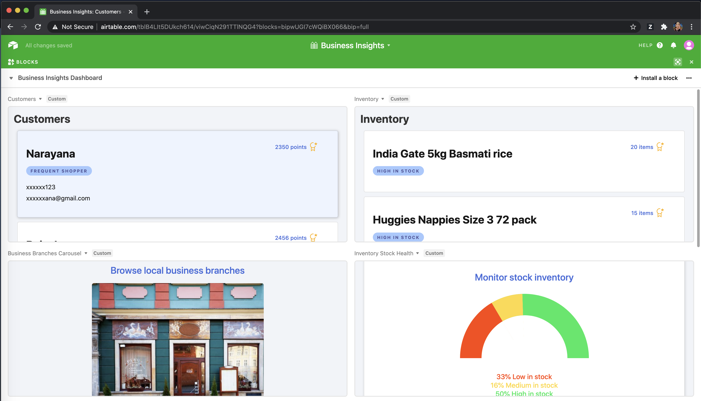
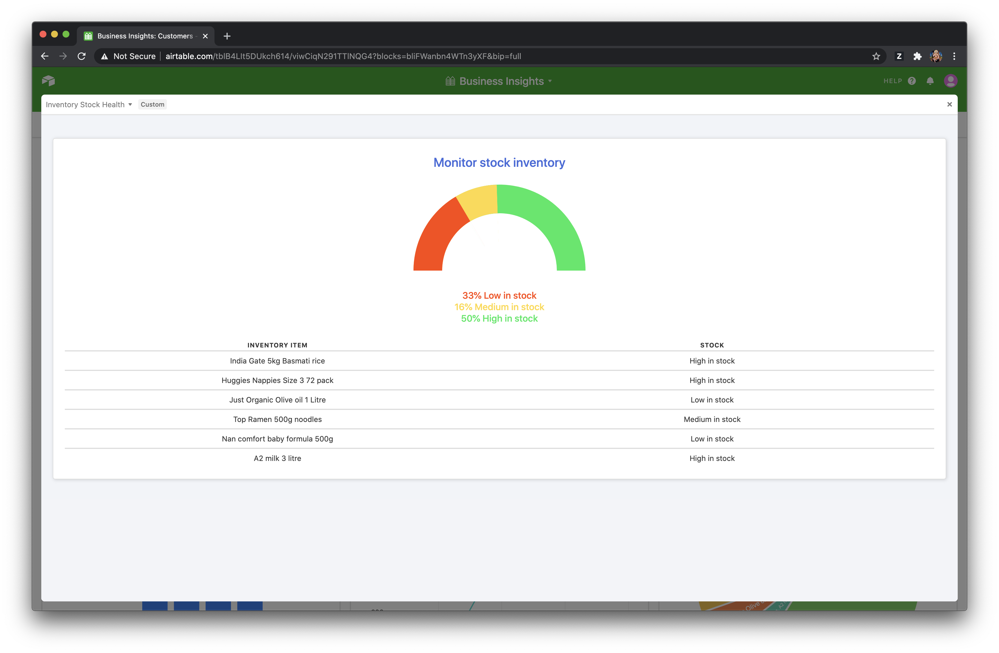

# Business Insights
Our idea is to create a dashboard that empowers business owners with valuable insights from transactional data.
We plan to issue reward points using blockchain and receive targetted deal recommendations using machine learning

## Inspiration
Customers love to avail discounts and deals. Business owners are constantly trying to increase sales by offering attractive deals. They wish to find trends in sales and suggestions of targeted deal recommendations for their loyal customers.

What is needed is a dashboard that empowers business owners with valuable insights from transactional data

## What it does
Our Air table dashboard helps business owner to visualise insights, sales and customer adoption trends, and promote contextual deals to customers based on their past transactions.

## How we built it
Created Custom Blocks Customers - A custom block for viewing reward points of customers, transactions, current and recommended deals for each customer Inventory - A custom block for viewing inventory stock details, recent stock bought and sold, current deals and recommended deals for a specific inventory item Branches - A custom block for browsing branches in a carousel style view Monitor Stock Inventory - A custom block for monitoring which inventory is running out of stock and needs refill etc.

Standard Blocks Sales trends(daily/weekly) - Amount of sales by day and week. Most popular deals - Popularity of deals Active deals - Number of deals Total customer rewards - Total reward points issued in a period Average weekly spend - Average weekly spend per customer.

## Challenges we ran into
There was a learning curve initially for Air Table. But the documentation is awesome, so did not take much time after that to sort things

## Accomplishments that we're proud of
We are able to use custom blocks beta version to create an insightful dashboard that can help business owners improve sales, plan promotions and increase customer adoption.

## What we learned
Airtable API hooks and React

## What's next for Grow Local
Integrating Blockchain as a rewards platform Integrating machine learning to build a deal recommendation engine specific to the customer.

## Built With
Airtable and React

## Try it out
1. Clone Git Repository
2. cd to business_insights and type block run
3. cd to inventory_visualisation and type block run
4. cd to inventory_stock_health and type block run
5. cd to business_branches_carousel and type block run
6. copy the local path(ex https://localhost:9000) of each block and run in Airtable dashboard(Edit block)

## Business Insights

### Customer list

### Customer details

### Invetory list

###  Invetory details

### Custom-block

### Standard blocks

### Monitor Inventory Asse list

### Browse branches

<a href="https://www.youtube.com/watch?v=SlPbxJK5jFE&feature=emb_title">View Demo</a>
